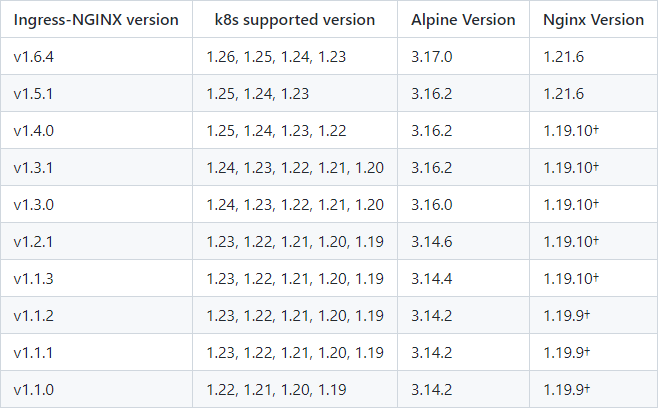

```shell
# 向外暴露应用
# Ingress 和 Pod 关系
# 1. Pod 和 Ingress 是通过 Service 关联的
# 2. Ingress 作为统一入口，由 Service 关联一组 Pod
```

---

## ingress-nginx



```txt
目前常用的 ingress-nginx 有俩个。一个是 kubernetes 官方开源的 ingress-nginx，一个是 nginx 官方开源的 ingress-nginx。区别如下
  1. kubernetes 官方的 Controller 是采用 Go 语言开发的，集成了 Lua 实现的 OpenResty；而 nginx 官方的 Controller 是集成 nginx
  2. 俩者的 nginx 配置不同，并且俩者使用的 nginx.conf 配置模板也是不一样的。
     nginx 官方采用的俩个模板文件以 include 的方式配置 upstream；
     kubernetes 官方版本采用 Lua 动态配置 upstream，所以不需要 reload
所以，在 Pod 频繁变更的场景下，采用 kubernetes 官方版本不需要 reload，影响更小

# kubernetes ingress-nginx
https://github.com/kubernetes/ingress-nginx
```

```shell
# version=v1.6.4 && wget -O ingress-nginx.yaml https://raw.githubusercontent.com/kubernetes/ingress-nginx/controller-$version/deploy/static/provider/cloud/deploy.yaml

# 镜像搬运
# grep -E ' *image:' ingress-nginx.yaml | sed 's/ *image: //' | sort | uniq
```

- ##### internal network

  ```txt
  在内部网络中，请求先经过 ingress-nginx(pod)，通过 nginx.conf 转发到相应的业务 service，再通过 service 请求 pod. (ingress-nginx(svc) 不参与请求处理)

  request => ingress-nginx(pod) => service => pod
  ```

  ```shell
  # 需暴露 ingress-nginx-controller 端口，并修改 service 代理方式、修改更新策略为 Recreate。
  if [[ ! $(cat ingress-nginx.yaml | grep "hostPort: 80") ]]; then sed -i '/containerPort: 80/a\          hostPort: 80' ingress-nginx.yaml; fi

  if [[ ! $(cat ingress-nginx.yaml | grep "hostPort: 443") ]]; then sed -i '/containerPort: 443/a\          hostPort: 443' ingress-nginx.yaml; fi

  # 修改 Service 代理方式
  sed -i -s 's/LoadBalancer/ClusterIP/' ingress-nginx.yaml

  # 因使用 hostPort 网络，nginx 重启时会因端口占用而处于 Pending 状态，需要修改更新策略为 Recreate
  sed -i '/minReadySeconds:/i\  strategy:\n    type: Recreate' ingress-nginx.yaml

  ...
  apiVersion: apps/v1
  kind: Deployment
  spec:
    strategy:
      type: Recreate
  ...
  ```

- ##### external network

  ```txt
  在外部网络中，用户通过外网域名，先经过第三方 DNS 服务器，将请求转发给 ingress-nginx(svc)，ingress-nginx(svc) 将请求分发给 ingress-nginx(pod)，再通过 nginx.conf 转发给业务 service，service 再请求 pod
  
  request => 第三方 DNS 服务器 => ingress-nginx(svc) => ingress-nginx(pod) => service => pod
  ```

```shell
# 修改资源限制
sed -i -s 's/90Mi/128Mi/' ingress-nginx.yaml
```

------

- ##### ConfigMap

  ```
  https://kubernetes.github.io/ingress-nginx/user-guide/nginx-configuration/configmap/
  ```

  ```yaml
  apiVersion: v1
  kind: ConfigMap
  data:
    ...
  metadata:
    name: ingress-nginx-controller
    namespace: ingress-nginx
  ```

- ##### Annotations

  ```
  https://kubernetes.github.io/ingress-nginx/user-guide/nginx-configuration/annotations/
  ```

  ```yaml
  apiVersion: networking.k8s.io/v1
  kind: Ingress
  metadata:
    name: nginx
    namespace: default
    annotations:
      # kubernetes.io/ingress.class: "nginx"                  # 等同于 ingressClassName: nginx
      nginx.ingress.kubernetes.io/enable-cors: "true"
      nginx.ingress.kubernetes.io/proxy-body-size: 1M         # default: 1M
      nginx.ingress.kubernetes.io/proxy-connect-timeout: '30' # 秒
      nginx.ingress.kubernetes.io/proxy-read-timeout: '30'    # 秒
      nginx.ingress.kubernetes.io/proxy-send-timeout: '30'    # 秒
      nginx.ingress.kubernetes.io/app-root: |                 # nginx root
        /usr/share/nginx/html
      nginx.ingress.kubernetes.io/rewrite-target: /$2         # url 重定向
      nginx.ingress.kubernetes.io/server-snippet: |           # 扩展到 nginx.server
        ...
      nginx.ingress.kubernetes.io/configuration-snippet: |    # 扩展到 nginx.server.localtion
        ...
  spec:
    ingressClassName: nginx
    rules:
    - host: demo.k8s.com
      http:
        paths:
        - path: /
          pathType: Prefix
          backend:
            service:
              name: nginx
              port:
                number: 8080
  
  ```

  ```yaml
  # cors
  apiVersion: networking.k8s.io/v1
  kind: Ingress
  metadata:
    name: nginx
    namespace: default
    annotations:
      nginx.ingress.kubernetes.io/enable-cors: "true"
      nginx.ingress.kubernetes.io/cors-allow-origin: "*"
      nginx.ingress.kubernetes.io/cors-allow-methods: "GET, PUT, POST, DELETE, OPTIONS"
      nginx.ingress.kubernetes.io/cors-allow-headers: "Authorization, Content-Type, Accept"
  ...
  ```
